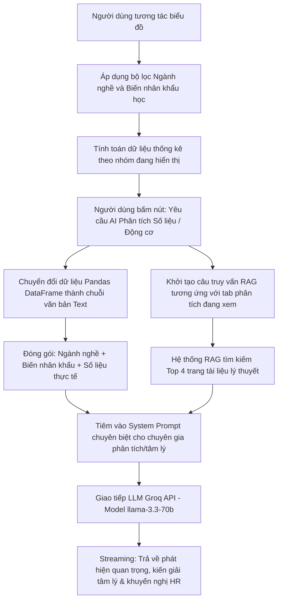
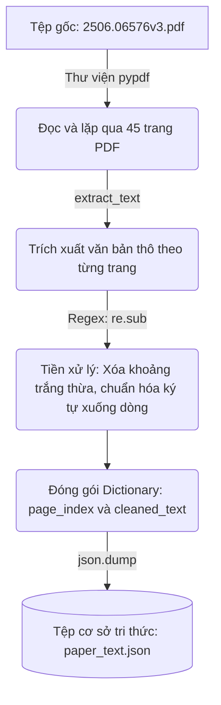
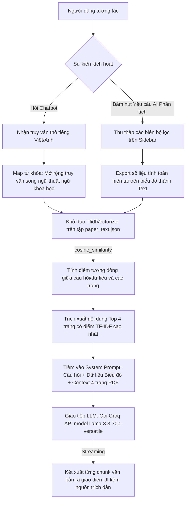

# WORKBank - Phân Tích & Khuyến Nghị Ứng Dụng AI Agent

Dự án này là một ứng dụng web trực quan hóa dữ liệu tương tác xây dựng trên Streamlit. Ứng dụng triển khai các phân tích từ bài báo khoa học "Future of Work with AI Agents" (WORKBank), đồng thời mở rộng thêm phần Nghiên cứu độc lập và hệ thống Trợ lý AI Khuyến nghị dựa trên dữ liệu thực tế.

Link Demo Trực Tuyến: [analysisaiagentforcs.streamlit.app](https://analysisaiagentforcs.streamlit.app/)

---

## 1. Các Phân Tích Cơ Bản (Từ Bài Báo Khoa Học)

Các phân tích dưới đây đã được đề cập trong bài báo khoa học gốc, ứng dụng trực quan hóa lại để người dùng dễ quan sát:

- Cảnh quan Tự động hóa: So sánh khả năng tự động hóa của AI và mong muốn tự động hóa của người lao động đối với các tác vụ IT.
- Phân bố & Bất cân đối: Thống kê số lượng tác vụ rơi vào các nhóm sẵn sàng tự động hóa hoặc có sự bất đồng giữa người lao động và khả năng của AI.
- Thang đo HAS (Worker vs Expert): So sánh góc nhìn về mức độ kiểm soát của con người đối với AI giữa người lao động và chuyên gia.
- Dịch chuyển Kỹ năng: Dự báo sự thay đổi về giá trị cốt lõi của các kỹ năng IT khi có sự can thiệp của AI.

---

## 2. Nghiên Cứu Độc Lập: Tâm Lý Học Lao Động & AI

### Quy Trình Khám Phá & Vấn Đề Nghiên Cứu
Khi phân tích bài báo gốc, dự án đã phát hiện ra các khoảng trống nghiên cứu cốt lõi dẫn đến việc định hướng lại góc nhìn phân tích:
1. Nhân khẩu học bị bỏ quên: Bài báo gốc thu thập thông tin tuổi, giới tính, học vấn nhưng chỉ dùng làm biến kiểm soát trong mô hình hồi quy. Lực lượng lao động bị coi là một khối đồng nhất.
2. Chỉ số an ninh việc làm bị coi nhẹ: Tác giả chỉ nhắc đến một câu về độ tương quan (negative correlation) mà không phân tích nhóm người nào đang lo sợ mất việc nhất và nguyên nhân do đâu.
3. Động cơ tự động hóa gộp chung toàn mẫu: Thực tế, động cơ muốn tự động hóa của một lập trình viên lâu năm hoàn toàn khác với nhân viên mới vào nghề, nhưng bài báo lại gộp chung mọi lý do (ví dụ báo cáo 69% chọn giải phóng thời gian).

Từ những hạn chế trên, dự án đã chuyển đổi góc nhìn từ *"Tác vụ nào bị tự động hóa?"* sang *"Người lao động nào cần được hỗ trợ và hỗ trợ như thế nào?"*. Bằng cách gộp (merge) dữ liệu đánh giá tác vụ với thông tin nhân khẩu học, hệ thống mang đến 2 phân tích chuyên sâu về hành vi tổ chức:

- Lệch Pha Nhận Thức (Nhân khẩu học & An ninh việc làm): Phát hiện ra sự bất đồng (ví dụ: nhóm học vị tiến sĩ có mong muốn tự động hóa cao nhất nhưng cũng lo sợ mất việc lớn nhất). Ứng dụng Ma trận Sẵn sàng Nhân sự (Worker Readiness Matrix) để phân loại người lao động dựa trên mô hình quản trị thay đổi ADKAR (Awareness, Desire, Knowledge, Ability, Reinforcement).
- Khác Biệt Động Cơ (Motivation Breakdown): Bóc tách 6 lý do muốn tự động hóa (Free Time, Repetitive, Human Error, v.v.) theo từng nhóm nhân khẩu. Ứng dụng Thuyết tự quyết (Self-Determination Theory) để giải thích sự khác biệt giữa nhu cầu Autonomy (Tự chủ), Competence (Năng lực) và Relatedness (Kết nối) của từng nhóm, từ đó cá nhân hóa chiến lược truyền thông nội bộ.

### Quy Trình Hoạt Động Của Trợ Lý AI Phân Tích Dữ Liệu
Ngoài các biểu đồ thống kê, phần Nghiên cứu Độc lập tích hợp một hệ thống AI tự động đọc hiểu số liệu đang được lọc trên màn hình để sinh ra các nhận định chuyên sâu và chiến lược quản trị thay đổi (Change Management) theo thời gian thực.



---

## 3. Hệ Thống RAG & Trợ Lý AI Khuyến Nghị

Ứng dụng tích hợp một hệ thống AI kết hợp với kỹ thuật RAG (Retrieval-Augmented Generation) để đọc hiểu tài liệu PDF gốc và đưa ra các khuyến nghị quản trị không bịa đặt (hallucination). 

### Quy Trình Xây Dựng Cơ Sở Tri Thức (Build Process)
Sử dụng script Python (`extract_paper.py`) để trích xuất, làm sạch và cấu trúc hóa toàn bộ văn bản từ file PDF 45 trang thành JSON phục vụ xử lý ngôn ngữ.



### Quy Trình Hoạt Động Của Hệ Thống (Operating Process)
Luồng xử lý khi người dùng tương tác, tính toán độ tương đồng TF-IDF để trích xuất ngữ cảnh và gọi API sinh câu trả lời.



---

## 4. Hướng Dẫn Cài Đặt

Yêu cầu hệ thống: Python 3.8 trở lên.

Cài đặt thư viện:
```bash
pip install -r requirements.txt
```

Cấu hình API Key:
Để hệ thống AI hoạt động, tạo file `api_key.txt` ở thư mục gốc dự án và dán Groq API Key của bạn vào đó, hoặc thiết lập biến môi trường `GROQ_API_KEY`.

Chạy ứng dụng:
```bash
streamlit run streamlit_app.py
```
