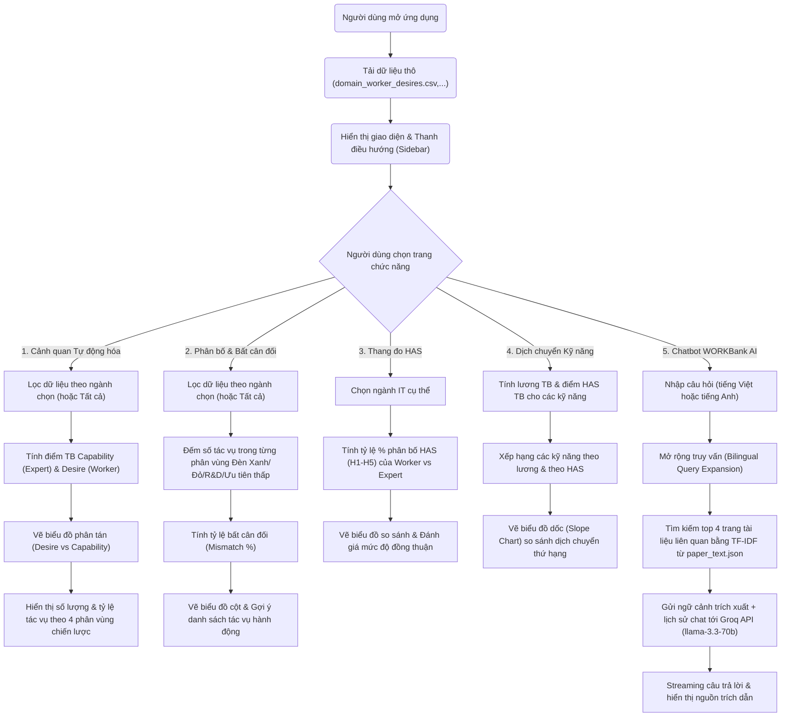

# WORKBank — Phân Tích & Khuyến Nghị Ứng Dụng AI Agent

Dự án này là một ứng dụng web trực quan hóa dữ liệu tương tác xây dựng trên thư viện **Streamlit** (Python). Ứng dụng triển khai các phân tích và khuyến nghị triển khai AI Agent dựa trên khung lý thuyết của bài báo khoa học: *"Future of Work with AI Agents: Auditing Automation and Augmentation Potential across the U.S. Workforce"* (WORKBank paper, arXiv:2506.06576).

**🌐 Link Demo Trực Tuyến:** [analysisaiagentforcs.streamlit.app](https://analysisaiagentforcs.streamlit.app/)

Ứng dụng tích hợp các biểu đồ tương tác cao cấp và một **Chatbot AI** thông minh được huấn luyện bằng toàn bộ tài liệu nghiên cứu gốc nhằm trả lời trực tiếp các câu hỏi của người dùng.

---

## 📌 Đặc Tả Yêu Cầu (Requirements Specification)

### 1. Yêu Cầu Chức Năng (Functional Requirements)
Ứng dụng được chia làm 5 trang chức năng chính điều hướng qua thanh bên (Sidebar):

*   **Trang 1: Cảnh Quan Tự Động Hóa (Automation Landscape)**
    *   Tổng hợp dữ liệu khảo sát và vẽ biểu đồ phân tán (Scatter Plot) so sánh **Khả năng công nghệ của AI** (trục X, từ 1-5) với **Mong muốn tự động hóa của người lao động** (trục Y, từ 1-5) cho các tác vụ trong 14 ngành IT.
    *   Chia biểu đồ thành 4 phân vùng chiến lược (Quadrants) phân tách bởi ngưỡng trung bình 3.0:
        *   `Green Light` (Đồng thuận cao - Sẵn sàng tự động hóa)
        *   `Red Light` (Khả năng cao nhưng worker phản đối - Cần thận trọng)
        *   `R&D Opportunity` (Worker muốn nhưng AI chưa đáp ứng - Cơ hội R&D)
        *   `Low Priority` (Ưu tiên thấp)
    *   Hiển thị tóm tắt thống kê số lượng và tỷ lệ % tác vụ rơi vào từng phân vùng.

*   **Trang 2: Phân Bố & Bất Cân Đối (Distribution & Mismatch)**
    *   Trực quan hóa phân phối số lượng tác vụ dưới dạng biểu đồ cột (Bar Chart).
    *   Tự động phát hiện và cảnh báo tỷ lệ bất cân đối (mismatch) giữa kỳ vọng của worker và khả năng của AI.
    *   Liệt kê các tác vụ cụ thể tiêu biểu trong vùng Đèn Đỏ (Red Light) và Đèn Xanh (Green Light).
    *   Đưa ra các khuyến nghị chiến lược cụ thể cho việc triển khai dự án AI.

*   **Trang 3: Thang Đo HAS — Worker vs Expert (HAS Spectrum)**
    *   Cho phép người dùng chọn 1 trong 14 ngành IT để phân tích chi tiết.
    *   Vẽ biểu đồ đường (Line Chart) so sánh tỷ lệ % phân phối các mức của **Thang đo Tác nhân Con người (Human Agency Scale - HAS, từ mức H1 đến H5)** giữa mong muốn của Worker và đánh giá của Expert.
    *   Tô màu vùng chênh lệch giữa hai đường đồ thị để làm nổi bật khoảng cách bất đồng ý kiến.
    *   Đưa ra kết luận tự động về mức độ đồng thuận: *Đồng thuận cao*, *Bất đồng trung bình* hoặc *Bất đồng lớn (Cảnh báo)*.

*   **Trang 4: Dịch Chuyển Kỹ Năng (Skill Shift)**
    *   Vẽ biểu đồ dốc (Slope Chart) so sánh **Thứ hạng theo lương trung bình hiện tại** với **Thứ hạng theo mức HAS tương lai** của các kỹ năng cốt lõi.
    *   Định dạng màu sắc trực quan: Màu đỏ biểu thị kỹ năng bị giảm giá trị (AI thay thế nhiều), màu xanh biểu thị kỹ năng lên ngôi (đòi hỏi con người kiểm soát).
    *   Hiển thị bảng chi tiết so sánh mức lương, điểm HAS trung bình và thứ hạng của từng kỹ năng.

*   **Trang 5: Chatbot WORKBank AI**
    *   Cung cấp khung chat hội thoại (Chat Interface) thân thiện giúp người dùng đặt câu hỏi.
    *   Trích xuất dữ liệu toàn văn của bài báo khoa học 45 trang (`2506.06576v3.pdf`) sang dạng JSON để truy xuất nhanh.
    *   Sử dụng thuật toán **TF-IDF Retriever** kết hợp mở rộng từ khóa song ngữ (Việt - Anh) để tìm các trang tài liệu tham chiếu sát nhất với câu hỏi.
    *   Tích hợp **Groq API** sử dụng mô hình LLM tiên tiến nhất (`llama-3.3-70b-versatile`) để tạo phản hồi dạng dòng chảy (Streaming) trực tiếp.
    *   Hiển thị phần trích dẫn nguồn tài liệu tham khảo cụ thể (collapsible expander) dưới mỗi câu trả lời.
    *   Ẩn hoàn toàn thông tin cấu hình API Key và cấu hình kỹ thuật để giữ thanh bên gọn gàng.

### 2. Yêu Cầu Phi Chức Năng (Non-functional Requirements)
*   **Giao diện sáng (Light Theme):** Toàn bộ ứng dụng sử dụng giao diện sáng cao cấp với tông nền trắng, sidebar màu xám Slate dịu mắt, đảm bảo độ tương phản chữ hoàn hảo, không bị che khuất chữ.
*   **Độ trễ thấp:** Ứng dụng sử dụng cơ chế lưu trữ bộ nhớ đệm `@st.cache_data` và `@st.cache_resource` để tải dữ liệu lớn nhanh chóng trong vòng dưới 1 giây.
*   **Bảo mật:** Groq API Key chạy ngầm và không hiển thị công khai trên giao diện người dùng.

---

## 💬 Phân Hệ Hỏi Đáp RAG (Retrieval-Augmented Generation)

Trang **Chatbot WORKBank AI** được xây dựng dựa trên kiến trúc **RAG (Truy xuất tăng cường ngữ cảnh)** gọn nhẹ và tối ưu hóa cao cho Streamlit mà không phụ thuộc vào các thư viện RAG cồng kềnh:

1. **Tiền xử lý & Trích xuất (Document Processing):**
   * Tệp nghiên cứu gốc `2506.06576v3.pdf` (45 trang) được xử lý bằng tập lệnh [extract_paper.py](file:///d:/Documents/Data%20Visualization/workbank/extract_paper.py) để tách văn bản theo từng trang, làm sạch và lưu trữ dưới dạng cấu trúc JSON [paper_text.json](file:///d:/Documents/Data%20Visualization/workbank/paper_text.json).
2. **Mở rộng truy vấn Song ngữ (Bilingual Query Expansion):**
   * Do bài báo viết bằng tiếng Anh nhưng người dùng có thể hỏi bằng tiếng Việt, ứng dụng tự động phân tích và mở rộng từ khóa tiếng Việt sang từ khóa tiếng Anh tương ứng (ví dụ: *"thang đo HAS"* $\rightarrow$ *"human agency scale has level"*, *"đèn đỏ"* $\rightarrow$ *"red light zone conflict"*,...).
3. **Bộ truy xuất TF-IDF (Text Retriever):**
   * Sử dụng một lớp `PaperRetriever` tự phát triển bằng Python thuần tính toán tần suất từ khóa TF-IDF trên 45 trang tài liệu, sắp xếp và lấy ra **top 4 trang** có điểm tương quan cao nhất làm ngữ cảnh hỗ trợ.
4. **Prompt Hệ thống & Gọi Groq API:**
   * Ngữ cảnh trích xuất từ 4 trang tài liệu được chèn vào Prompt hệ thống cùng các định nghĩa cốt lõi cứng về thang đo HAS và 4 vùng phân tích.
   * Yêu cầu được gửi đến Groq API chạy mô hình `llama-3.3-70b-versatile` với tham số `stream=True` giúp phản hồi hiển thị mượt mà theo thời gian thực (chữ chạy dần).
   * Dưới mỗi câu trả lời của AI, ứng dụng hiển thị một hộp mở rộng chứa văn bản gốc của các trang tài liệu tham chiếu giúp người dùng đối chiếu thông tin chính xác.

---

## 📊 Sơ Đồ Luồng Hoạt Động (Flowchart)

Dưới đây là Sơ đồ luồng hoạt động (Flowchart) mô tả cách thức xử lý dữ liệu và luồng đi của ứng dụng:



---

## 🛠️ Hướng Dẫn Cài Đặt & Chạy Ứng Dụng

### 1. Chuẩn bị môi trường
Yêu cầu hệ thống đã cài đặt **Python 3.8+**. Cài đặt các thư viện phụ thuộc bằng lệnh sau:

```bash
pip install streamlit pandas numpy plotly pypdf groq
```

### 2. Chạy ứng dụng Streamlit
Mở terminal tại thư mục chứa mã nguồn dự án và chạy lệnh:

```bash
streamlit run streamlit_app.py
```

Ứng dụng sẽ tự động mở trên trình duyệt mặc định của bạn tại địa chỉ `http://localhost:8501/`.
