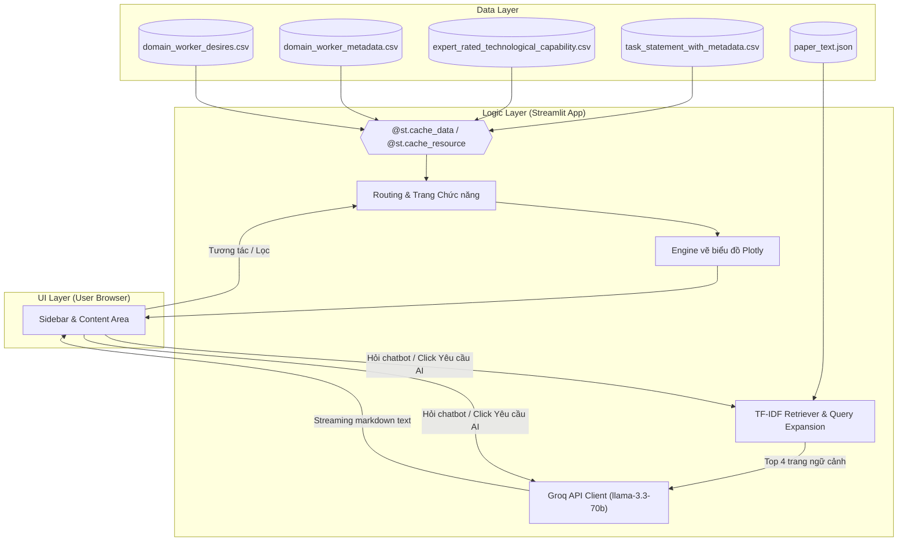
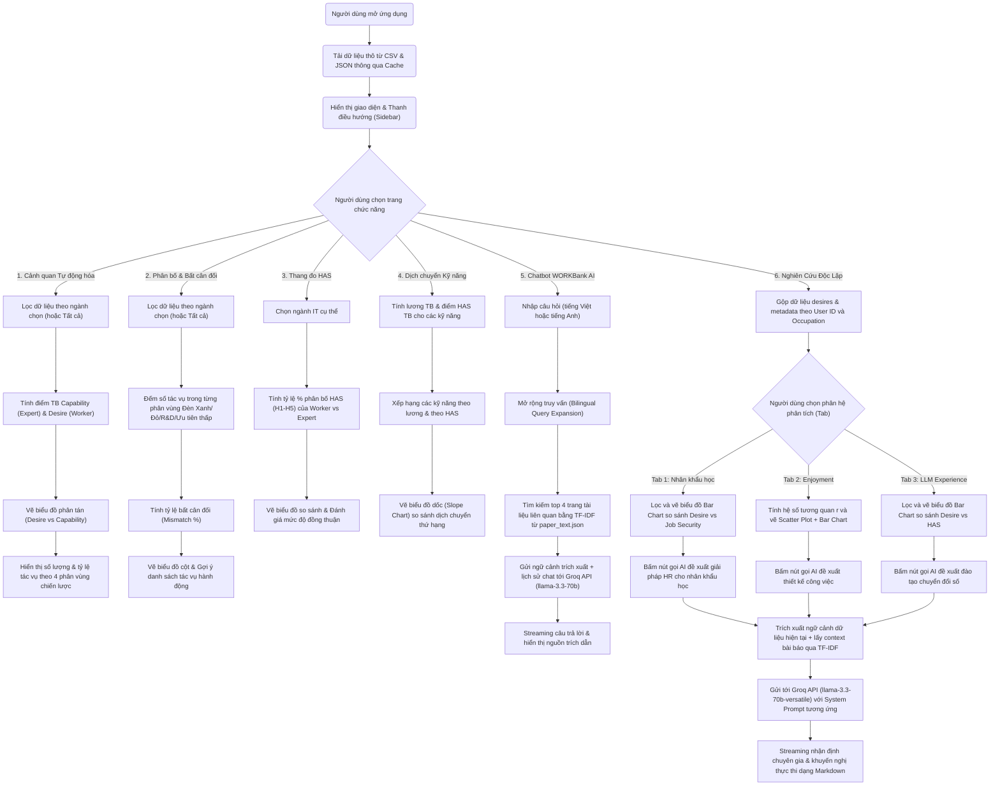

# WORKBank — Phân Tích & Khuyến Nghị Ứng Dụng AI Agent

Dự án này là một ứng dụng web trực quan hóa dữ liệu tương tác xây dựng trên thư viện **Streamlit** (Python). Ứng dụng triển khai các phân tích và khuyến nghị triển khai AI Agent dựa trên khung lý thuyết của bài báo khoa học: *"Future of Work with AI Agents: Auditing Automation and Augmentation Potential across the U.S. Workforce"* (WORKBank paper, arXiv:2506.06576).

**🌐 Link Demo Trực Tuyến:** [analysisaiagentforcs.streamlit.app](https://analysisaiagentforcs.streamlit.app/)

Ứng dụng tích hợp các biểu đồ tương tác cao cấp bằng **Plotly** và một **Chatbot AI** thông minh được huấn luyện bằng toàn bộ tài liệu nghiên cứu gốc nhằm trả lời trực tiếp các câu hỏi của người dùng và sinh các kiến giải (AI Insights) theo dữ liệu thời gian thực.

---

## 📁 Cấu Trúc Thư Mục Dự Án (Project Directory Structure)

Dưới đây là cấu trúc tệp tin và các thư mục cốt lõi của dự án:

```text
workbank/
├── .streamlit/
│   └── config.toml         # Cấu hình giao diện Streamlit (Light theme, màu chủ đạo)
├── .gitignore              # Định nghĩa các tệp tin và thư mục không theo dõi bởi Git
├── 2506.06576v3.pdf        # Bài báo khoa học gốc WORKBank (PDF, 45 trang)
├── README.md               # Tài liệu hướng dẫn sử dụng và giới thiệu dự án (bản hiện tại)
├── analysis_relationships_enjoyment_llm.md # Báo cáo phân tích chuyên sâu về Enjoyment và LLM
├── domain_worker_desires.csv # Bộ dữ liệu khảo sát mong muốn tự động hóa & điểm HAS của Workers
├── domain_worker_metadata.csv # Dữ liệu nhân khẩu học (Age, Education, Gender, Experience, LLM,...)
├── expert_rated_technological_capability.csv # Đánh giá khả năng công nghệ của AI từ các chuyên gia
├── extract_paper.py        # Kịch bản Python dùng để trích xuất văn bản từ tệp PDF sang JSON (bị ignore)
├── paper_text.json         # Dữ liệu văn bản bài báo khoa học được tổ chức theo trang phục vụ RAG
├── project_evaluation_report.md # Báo cáo đánh giá tổng quan dự án
├── project_report_and_defense_guide.md # Hướng dẫn thuyết trình và câu hỏi bảo vệ dự án
├── requirements.txt        # Liệt kê các thư viện Python cần cài đặt
├── streamlit_app.py        # Mã nguồn chính của ứng dụng web Streamlit (routing, giao diện, logic)
├── task_statement_with_metadata.csv # Dữ liệu các tác vụ, kỹ năng và mức lương tương ứng
└── operational_workflow_guide.md # Hướng dẫn chi tiết luồng hoạt động & phân tích kỹ thuật hệ thống
```

---

## 📌 Đặc Tả Yêu Cầu Chức Năng (Functional Requirements)

Ứng dụng bao gồm 6 trang phân tích tương tác nâng cao, dễ dàng điều hướng qua Sidebar:

### 1. Trang 1: Cảnh Quan Tự Động Hóa (Automation Landscape)
*   **Chức năng:** Tổng hợp dữ liệu khảo sát và vẽ biểu đồ phân tán (Scatter Plot) so sánh **Khả năng công nghệ của AI** (trục X, từ 1-5) với **Mong muốn tự động hóa của người lao động** (trục Y, từ 1-5) cho các tác vụ trong 14 ngành IT.
*   **Phân vùng chiến lược:** Chia biểu đồ thành 4 phân vùng chiến lược dựa trên ngưỡng trung bình 3.0:
    *   `Green Light` (Đồng thuận cao - Sẵn sàng tự động hóa)
    *   `Red Light` (Khả năng cao nhưng worker phản đối - Cần thận trọng)
    *   `R&D Opportunity` (Worker muốn nhưng AI chưa đáp ứng - Cơ hội R&D)
    *   `Low Priority` (Ưu tiên thấp)
*   **Thống kê:** Hiển thị số lượng và tỷ lệ phần trăm tác vụ rơi vào từng phân vùng dưới dạng metric động.

### 2. Trang 2: Phân Bố & Bất Cân Đối (Distribution & Mismatch)
*   **Chức năng:** Trực quan hóa phân phối số lượng tác vụ dưới dạng biểu đồ cột (Bar Chart).
*   **Cảnh báo:** Tự động phát hiện và cảnh báo tỷ lệ bất cân đối (mismatch) giữa kỳ vọng của worker và khả năng của AI.
*   **Liệt kê:** Hiển thị danh sách top tác vụ tiêu biểu trong vùng Đèn Đỏ (Red Light) và Đèn Xanh (Green Light).
*   **Khuyến nghị:** Đưa ra các khuyến nghị chiến lược cụ thể cho việc triển khai dự án AI trong tổ chức.

### 3. Trang 3: Thang Đo HAS — Worker vs Expert (HAS Spectrum)
*   **Chức năng:** Cho phép chọn 1 trong 14 ngành IT để phân tích sự chênh lệch góc nhìn.
*   **Biểu đồ:** Vẽ biểu đồ đường (Line Chart) so sánh phân phối tỷ lệ % các mức của **Thang đo Tác nhân Con người (Human Agency Scale - HAS, từ H1 đến H5)** giữa Worker và Expert.
*   **Trực quan trực tiếp:** Tô màu vùng chênh lệch giữa hai đường để làm nổi bật khoảng cách bất đồng.
*   **Đánh giá:** Đưa ra kết luận tự động về mức độ đồng thuận (*Đồng thuận cao*, *Bất đồng trung bình*, hoặc *Bất đồng lớn (Cảnh báo)*) dựa trên khoảng cách giữa các mức HAS phổ biến nhất.

### 4. Trang 4: Dịch Chuyển Kỹ Năng (Skill Shift)
*   **Chức năng:** Vẽ biểu đồ dốc (Slope Chart) so sánh **Thứ hạng theo lương trung bình hiện tại** với **Thứ hạng theo mức HAS tương lai** của các kỹ năng IT cốt lõi.
*   **Phân biệt màu sắc:** Đường màu đỏ biểu thị kỹ năng bị giảm giá trị (AI thay thế nhiều), màu xanh biểu thị kỹ năng lên ngôi (đòi hỏi con người kiểm soát).
*   **Bảng chi tiết:** Cung cấp bảng dữ liệu chi tiết so sánh mức lương, điểm HAS trung bình và thứ hạng của từng kỹ năng.

### 5. Trang 5: Chatbot WORKBank AI
*   **Chức năng:** Cung cấp khung chat hội thoại (Chat Interface) thân thiện giúp người dùng đặt câu hỏi.
*   **Cơ sở tri thức:** Sử dụng tệp dữ liệu tri thức `paper_text.json` (được trích xuất từ tài liệu 45 trang).
*   **Truy xuất ngữ cảnh:** Thuật toán **TF-IDF Retriever** kết hợp mở rộng từ khóa song ngữ (Việt - Anh) tự động tìm kiếm top 4 trang tài liệu liên quan nhất.
*   **Tạo câu trả lời:** Gửi ngữ cảnh trích xuất và lịch sử trò chuyện đến **Groq API** (`llama-3.3-70b-versatile`) để sinh phản hồi dạng dòng chảy (Streaming) mượt mà.
*   **Minh bạch nguồn tin:** Hiển thị phần trích dẫn nguồn tài liệu tham khảo cụ thể dưới mỗi câu trả lời.

### 6. Trang 6: ✨ Nghiên Cứu Độc Lập (New Insights)
*   **Ý Tưởng & Động Lực Nghiên Cứu (Motivation & Research Context):**
    *   *Tại sao lại có ý tưởng này?* Bài báo khoa học gốc (*WORKBank*, arXiv:2506.06576) chỉ tập trung phân tích khả năng của AI (expert-rated) và mong muốn tự động hóa của người lao động ở mức độ tác vụ chung cho toàn thị trường. Tuy nhiên, nghiên cứu này coi lực lượng lao động là một khối đồng nhất (homogeneous group), bỏ qua các yếu tố cá nhân như nhân khẩu học, động lực nội tại, và mức độ tiếp xúc thực tế với công nghệ.
    *   Trong thực tế doanh nghiệp, việc triển khai AI Agent thành công phụ thuộc lớn vào **Tâm lý học lao động (Occupational Psychology)** và **Hành vi tổ chức (Organizational Behavior)** nhằm giảm thiểu sự kháng cự công nghệ (Change Resistance). Do đó, trang phân tích này được thiết kế để gộp dữ liệu thô từ khảo sát với thông tin nhân sự nhằm tìm ra các mối tương quan thực tế, giúp doanh nghiệp thiết kế lộ trình chuyển đổi số "Worker-Centric" (Lấy con người làm trung tâm).
*   **Phương Pháp Kết Nối Dữ Liệu (Data Integration Method):**
    *   Ý tưởng được hiện thực hóa bằng cách gộp (merge) dữ liệu thô cấp tác vụ với thông tin cá nhân của người tham gia khảo sát dựa trên khóa liên kết `["User ID", "Occupation (O*NET-SOC Title)"]` thông qua hàm [build_insights_df](file:///d:/Documents/Data%20Visualization/workbank/streamlit_app.py#L174-L185) trong tệp [streamlit_app.py](file:///d:/Documents/Data%20Visualization/workbank/streamlit_app.py).
    *   **Tệp tin sử dụng:**
        1.  [domain_worker_desires.csv](file:///d:/Documents/Data%20Visualization/workbank/domain_worker_desires.csv): Lưu trữ đánh giá của người lao động cho từng tác vụ cụ thể.
        2.  [domain_worker_metadata.csv](file:///d:/Documents/Data%20Visualization/workbank/domain_worker_metadata.csv): Lưu trữ thông tin nhân khẩu học và mức độ tiếp xúc với LLM của người lao động.
*   **Chi Tiết Các Phân Hệ (Tabs) & Dẫn Chứng Cột Dữ Liệu (Features Citation):**
    *   **Tab 1: Nhân khẩu học & An ninh việc làm:**
        *   *Ý nghĩa*: Đánh giá sự khác biệt trong thái độ đối với AI và nỗi lo sợ mất việc giữa các nhóm học vấn, giới tính, kinh nghiệm và độ tuổi khác nhau trong ngành IT.
        *   *Tính toán & Dẫn chứng*:
            *   **Nhóm phân tích (X-axis):** Lọc theo các cột từ [domain_worker_metadata.csv](file:///d:/Documents/Data%20Visualization/workbank/domain_worker_metadata.csv) gồm `Education` (Trình độ học vấn), `Gender` (Giới tính), `Experience` (Kinh nghiệm làm việc), và `Age` (Tuổi - được chia thành các nhóm tuổi).
            *   **Chỉ số đo lường (Y-axis):** Tính toán giá trị trung bình (mean) của cột `Automation Desire Rating` (Mong muốn tự động hóa) và cột `Job Security Rating` (Mức độ lo ngại an ninh việc làm) lấy từ [domain_worker_desires.csv](file:///d:/Documents/Data%20Visualization/workbank/domain_worker_desires.csv).
    *   **Tab 2: Enjoyment vs. Tự động hóa:**
        *   *Ý nghĩa*: Khảo sát quy luật tâm lý học lao động dựa trên *Thuyết tự quyết (Self-Determination Theory)*. Người lao động có xu hướng muốn giữ lại những công việc mang lại động lực nội tại cao (Enjoyment cao) và muốn đẩy các tác vụ tẻ nhạt, lặp đi lặp lại (Enjoyment thấp) cho AI. Việc cố tình tự động hóa phần việc nhân viên yêu thích sẽ tạo ra sự kháng cự ngầm rất lớn.
        *   *Tính toán & Dẫn chứng*:
            *   Tính toán **Hệ số tương quan Pearson ($r$)** và vẽ biểu đồ phân tán (Scatter Plot) giữa cột `Enjoyment Rating` (Mức độ yêu thích tác vụ, thang 1-5) và cột `Automation Desire Rating` (Mong muốn tự động hóa, thang 1-5) từ tệp [domain_worker_desires.csv](file:///d:/Documents/Data%20Visualization/workbank/domain_worker_desires.csv).
    *   **Tab 3: Trải nghiệm LLM & Quyền kiểm soát:**
        *   *Ý nghĩa*: Giải thích bằng *Mô hình Chấp nhận Công nghệ (Technology Acceptance Model - TAM)*. Những người thực tế sử dụng LLM hàng ngày/hàng tuần có góc nhìn thực tế về năng lực của công cụ, từ đó sẵn sàng chuyển giao các công việc lặp đi lặp lại cho AI hơn so với nhóm chưa từng tiếp xúc (nhóm e ngại mơ hồ do tin đồn).
        *   *Tính toán & Dẫn chứng*:
            *   **Biến trải nghiệm (X-axis):** Cột `LLM Use in Work` (Tần suất sử dụng) hoặc cột `LLM Familiarity` (Mức độ quen thuộc) lấy từ [domain_worker_metadata.csv](file:///d:/Documents/Data%20Visualization/workbank/domain_worker_metadata.csv).
            *   **Chỉ số đo lường (Y-axis):** Tính toán giá trị trung bình của cột `Automation Desire Rating` (Mong muốn tự động hóa) và cột `Human Agency Scale Rating` (Mức độ kiểm soát mong muốn của con người - HAS) lấy từ [domain_worker_desires.csv](file:///d:/Documents/Data%20Visualization/workbank/domain_worker_desires.csv).


---

## ⚙️ Cơ Chế Hoạt Động & Kiến Trúc Kỹ Thuật (System Architecture & How It Works)

### 1. Kiến trúc tổng quan (Architecture Overview)
Ứng dụng hoạt động theo kiến trúc **Client-Server** đơn trang dựa trên Streamlit:
*   **Frontend:** Renders giao diện người dùng tương tác, xử lý sự kiện lọc và gọi các biểu đồ Plotly động.
*   **Data Processing Layer:** Đọc dữ liệu từ 4 tệp tin CSV bằng thư viện Pandas. Tận dụng cơ chế cache `@st.cache_data` để đảm bảo tải dữ liệu siêu tốc (< 1s).
*   **Retrieval-Augmented Generation (RAG) & AI Insights Engine:**
    *   Sử dụng **TF-IDF Paper Retriever** tự phát triển để tìm kiếm ngữ cảnh có độ tương đồng văn bản cao trong `paper_text.json`.
    *   Gọi **Groq API** sử dụng model `llama-3.3-70b-versatile` để sinh câu trả lời chatbot (ở trang 5) và các phân tích khuyến nghị chiến lược động dựa trên biểu đồ thực tế (ở trang 6).



### 2. Chi tiết luồng RAG của Chatbot
1.  **Mở rộng truy vấn (Query Expansion):** Khi người dùng hỏi bằng tiếng Việt, lớp `PaperRetriever` tự động tìm và bổ sung các thuật ngữ tiếng Anh khoa học tương đương (ví dụ: "đèn đỏ" -> "red light zone conflict worker desire").
2.  **Tính điểm TF-IDF:** Văn bản được tách thành các token viết thường. Điểm số TF-IDF được tính trên 45 trang của bài báo để xếp hạng.
3.  **Lấy Context & Gửi Prompt:** Top 4 trang có điểm cao nhất được kết hợp vào prompt hệ thống cùng hướng dẫn chi tiết của AI và lịch sử chat (tối đa 6 câu thoại gần nhất).
4.  **Streaming output:** Kết quả phản hồi từ Groq được trả về dưới dạng dòng chảy (stream) giúp tăng trải nghiệm người dùng.

### 3. Cơ chế Phân Tích Dữ Liệu Tự Động bằng AI (AI Insights)
Tại trang **Nghiên Cứu Độc Lập**:
1.  Người dùng áp dụng các bộ lọc nhân khẩu học, độ yêu thích hoặc tần suất sử dụng LLM.
2.  Hệ thống tính toán các chỉ số thống kê thực tế (trung bình mong muốn tự động hóa, lo ngại an ninh, hệ số tương quan r).
3.  Khi click vào **✨ Yêu cầu AI phân tích dữ liệu & Khuyến nghị**, hệ thống đóng gói:
    *   Ngữ cảnh dữ liệu thực tế đang hiển thị trên biểu đồ.
    *   Ngữ cảnh lý thuyết trích xuất từ bài báo khoa học qua bộ tìm kiếm TF-IDF.
    *   System Prompt hướng dẫn cụ thể vai trò của AI.
4.  Dữ liệu được gửi tới Groq để sinh ra các phân tích HR và quản trị thay đổi được may đo riêng cho dữ liệu đang lọc.

---

## 📊 Sơ Đồ Luồng Hoạt Động Chi Tiết (Detailed Web Workflow)

Sơ đồ dưới đây mô tả chi tiết toàn bộ luồng hoạt động từ lúc người dùng mở ứng dụng đến khi các trang hiển thị biểu đồ và tương tác với AI:



---

## 🛠️ Hướng Dẫn Cài Đặt & Chạy Ứng Dụng (Installation & Run Guide)

### 1. Chuẩn bị môi trường
Yêu cầu hệ thống cài đặt **Python 3.8+**. Để cài đặt các thư viện phụ thuộc, hãy sử dụng file `requirements.txt` bằng lệnh sau:

```bash
pip install -r requirements.txt
```

Hoặc cài đặt thủ công các thư viện cốt lõi:

```bash
pip install streamlit pandas numpy plotly pypdf groq
```

### 2. Cấu hình Groq API Key
Để sử dụng **Chatbot WORKBank AI** và **Trợ lý AI Khuyến nghị** ở trang 6, bạn cần cung cấp Groq API Key theo một trong các cách sau:
1.  **Môi trường cục bộ:** Tạo tệp tin `api_key.txt` nằm tại thư mục gốc của dự án và dán API Key của bạn vào đó.
2.  **Biến môi trường (Environment Variable):** Thiết lập biến môi trường `GROQ_API_KEY` trên hệ điều hành của bạn.
3.  **Streamlit Secrets (Dành cho deploy):** Thiết lập trong phần Secrets của Streamlit Cloud với định dạng:
    ```toml
    GROQ_API_KEY = "your_actual_groq_api_key_here"
    ```

### 3. Khởi chạy ứng dụng Streamlit
Mở terminal tại thư mục chứa mã nguồn dự án và khởi chạy lệnh:

```bash
streamlit run streamlit_app.py
```

Ứng dụng sẽ tự động mở trên trình duyệt mặc định của bạn tại địa chỉ: `http://localhost:8501/`
