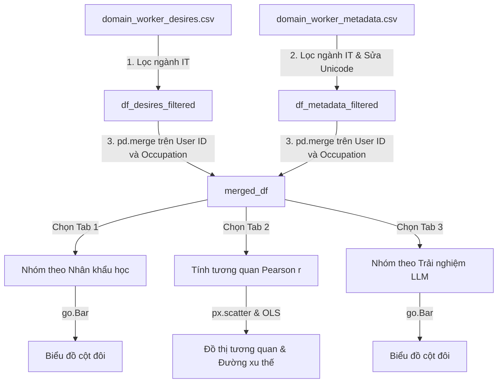

# Hướng Dẫn Luồng Hoạt Động & Kiến Trúc Vận Hành (Under the Hood)

Tài liệu này giải thích chi tiết **luồng dữ liệu (Data Pipeline)**, **cấu trúc dữ liệu**, và **thuật toán vận hành** bên trong mã nguồn [streamlit_app.py](file:///d:/Documents/Data%20Visualization/workbank/streamlit_app.py). Đây là kiến thức cốt lõi giúp bạn giải thích cách chương trình chạy để tạo ra các biểu đồ và phân tích cho giáo viên.

---

## 1. Vòng Đời Chạy Chương Trình của Streamlit (Execution Lifecycle)

Không giống các ứng dụng web truyền thống (như React hay Spring Boot) chạy bất đồng bộ dựa trên sự kiện, Streamlit hoạt động theo cơ chế **Chạy lại toàn bộ (Top-down Rerun)**:
1. **Mỗi khi người dùng tương tác** (chọn menu, bấm nút, kéo thanh trượt), Streamlit sẽ **chạy lại toàn bộ tệp tin python từ dòng 1 đến dòng cuối cùng**.
2. **Cơ chế Cache (`@st.cache_data` và `@st.cache_resource`)**: Để tránh việc đọc lại 4 tệp tin CSV nặng từ đĩa cứng ở mỗi lần tương tác (làm chậm app), hàm [load_data](file:///d:/Documents/Data%20Visualization/workbank/streamlit_app.py#L47-L53) được bọc trong `@st.cache_data`. Pandas chỉ đọc file một lần duy nhất và lưu trữ DataFrame trong RAM. Các lần chạy lại sau sẽ lấy trực tiếp từ RAM trong vòng dưới **10 mili-giây**.

---

## 2. Luồng Xử Lý Dữ Liệu của Trang "Nghiên Cứu Độc Lập" (Page 6)

Trang này hoạt động dựa trên việc ghép nối (merge) thông tin cá nhân của người lao động với mong muốn tác vụ của họ.



### Bước 1: Ghép và Làm sạch dữ liệu (Data Integration & Cleaning)
Hàm [build_insights_df](file:///d:/Documents/Data%20Visualization/workbank/streamlit_app.py#L174-L185) thực hiện:
1. Đọc tệp [domain_worker_desires.csv](file:///d:/Documents/Data%20Visualization/workbank/domain_worker_desires.csv) và lọc ra các bản ghi thuộc danh sách 14 ngành IT (`IT_OCCUPATIONS`).
2. Đọc tệp [domain_worker_metadata.csv](file:///d:/Documents/Data%20Visualization/workbank/domain_worker_metadata.csv), làm sạch cột `Education` bằng cách thay thế các ký tự Unicode lỗi (ví dụ: dấu nháy thông minh `\u2019` thành dấu nháy thẳng `'`).
3. Thực hiện thuật toán **Inner Join (Ghép trong)** bằng hàm `pd.merge` trên 2 cột khóa liên kết: `User ID` và `Occupation (O*NET-SOC Title)`.
   - Kết quả thu được là `merged_df` chứa cả thông tin nhiệm vụ (điểm mong muốn, điểm yêu thích) và nhân khẩu học của từng worker cụ thể.

---

## 3. Cơ Chế Vận Hành Chi Tiết của 3 Phân Hệ (Tabs)

### 📊 Tab 1: Nhân khẩu học & An ninh việc làm
1. **Lắng nghe sự kiện**: Khi người dùng chọn một biến (ví dụ: `Giới tính`), Streamlit ghi nhận giá trị và gán vào `demographic_var`.
2. **Gom nhóm & Tính toán**: 
   - Mã nguồn thực hiện câu lệnh `.groupby(group_col)` trên biến nhân khẩu học đã chọn.
   - Gọi hàm `.mean()` trên hai cột: `Automation Desire Rating` (Mong muốn tự động hóa) và `Job Security Rating` (Lo ngại mất việc).
3. **Trực quan hóa**:
   - Sử dụng lớp `go.Figure` của Plotly để vẽ hai chuỗi cột dọc sát nhau (`go.Bar` màu xanh biểu diễn Desire, màu đỏ biểu diễn Job Security).
4. **Luồng phân tích AI (AI Insights Engine)**:
   - Khi nhấn nút *"Yêu cầu AI phân tích"*, chương trình sẽ chuyển đổi bảng số liệu thống kê trung bình thành một chuỗi văn bản (String context).
   - Hàm [generate_ai_insight_stream](file:///d:/Documents/Data%20Visualization/workbank/streamlit_app.py#L852-L899) sẽ gửi chuỗi số liệu này cùng prompt hướng dẫn đến **Groq API (Model Llama 3.3 70B)**.
   - Kết quả phản hồi của AI được sinh ra dưới dạng **Generator stream (`yield`)** giúp chữ chảy ra màn hình từng từ một theo thời gian thực thay vì đợi load xong toàn bộ.

### ❤️ Tab 2: Enjoyment vs. Tự động hóa
1. **Tính toán tương quan**:
   - Mã nguồn nhóm dữ liệu theo từng tác vụ (`Task ID`) để tính điểm Yêu thích trung bình (`Enjoyment Rating`) và điểm Mong muốn tự động hóa trung bình (`Automation Desire Rating`) của tác vụ đó.
   - Sử dụng hàm `.corr()` của Pandas để tính **Hệ số tương quan Pearson ($r$)** giữa mức độ yêu thích và mong muốn tự động hóa.
2. **Vẽ biểu đồ**:
   - Sử dụng `px.scatter` vẽ đồ thị chấm biểu diễn từng tác vụ.
   - Thêm tham số `trendline="ols"` (Ordinary Least Squares - Bình phương tối thiểu) để Plotly tự động chạy một mô hình hồi quy tuyến tính đơn giản dưới nền và vẽ **đường xu thế màu đỏ** thể hiện độ dốc tương quan.

### 🤖 Tab 3: Trải nghiệm LLM & Quyền kiểm soát (HAS)
1. **Sắp xếp thứ tự logic**: 
   - Dữ liệu tần suất sử dụng LLM là dữ liệu phân loại thứ bậc (Ordinal Data). Nếu nhóm thông thường, các nhãn như "Hàng ngày", "Chưa từng dùng", "Hàng tuần" sẽ bị sắp xếp theo bảng chữ cái ABC làm mất tính logic.
   - Chương trình sử dụng kiểu dữ liệu danh mục của Pandas: `pd.Categorical` với danh sách thứ tự định sẵn (`llm_order`) để ép buộc biểu đồ sắp xếp từ *Chưa từng dùng* tăng dần đến *Hàng ngày*.
2. **Tính toán & Trực quan**:
   - Tiến hành `.groupby` theo tần suất sử dụng để tính điểm trung bình của mong muốn tự động hóa (`Automation Desire Rating`) và mức độ kiểm soát mong muốn của con người (`Human Agency Scale Rating - HAS`).
   - Renders biểu đồ cột đôi so sánh trực diện hai chỉ số này.

---

## 4. Luồng Xử Lý Tri Thức của Chatbot RAG (Page 5)

Trang Chatbot hoạt động dựa trên mô hình **RAG (Retrieval-Augmented Generation)** tự phát triển để tăng độ chính xác của AI dựa trên file PDF nghiên cứu gốc.

```text
[Người dùng hỏi] 
       │
       ▼
1. Mở rộng truy vấn (Query Expansion): Tra từ điển đồng nghĩa để thêm từ tiếng Anh
       │
       ▼
2. Phân tách Token (Tokenization): Tách câu thành danh sách từ viết thường
       │
       ▼
3. Tính TF-IDF Similarity: So khớp tần suất từ với 45 trang trong paper_text.json
       │
       ▼
4. Lấy Context: Chọn ra Top 4 trang tài liệu có điểm số cao nhất
       │
       ▼
5. Gửi Prompt & Lịch sử chat (6 câu) sang Groq API (Llama 3.3)
       │
       ▼
6. Stream phản hồi (chữ chạy dần) + Trích dẫn nguồn (Trang X) ra màn hình
```

### Chi tiết các lớp mã nguồn:
* **Lớp `PaperRetriever`**:
  - Khi khởi tạo, nó đọc tệp `paper_text.json` và phân tách văn bản của mỗi trang thành các từ viết thường.
  - Tính tần suất tài liệu ngược (IDF) cho mỗi từ: $IDF(t) = \ln(\frac{N + 1}{DF(t) + 1}) + 1$ để xác định tầm quan trọng của từ khóa.
* **Mở rộng truy vấn**:
  - Vì người dùng thường hỏi bằng tiếng Việt, hàm `_expand_query` sẽ dịch hoặc bổ sung các thuật ngữ tiếng Anh tương đương từ bài báo (ví dụ: từ "đèn đỏ" sẽ được mở rộng thêm cụm từ nghiên cứu gốc "red light zone conflict worker desire"). Điều này giúp thuật toán TF-IDF so khớp chính xác với văn bản tiếng Anh trong bài báo gốc.
